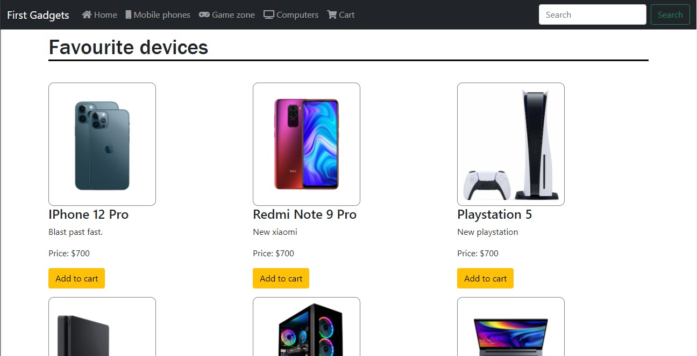
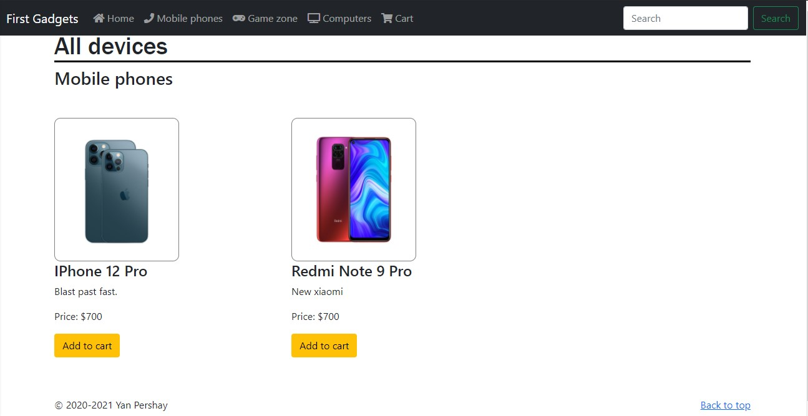
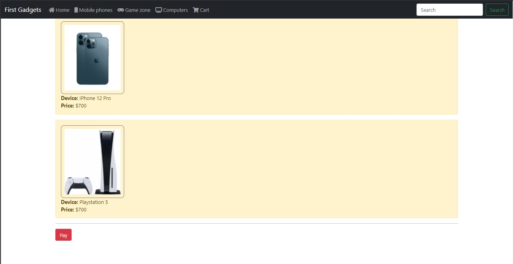
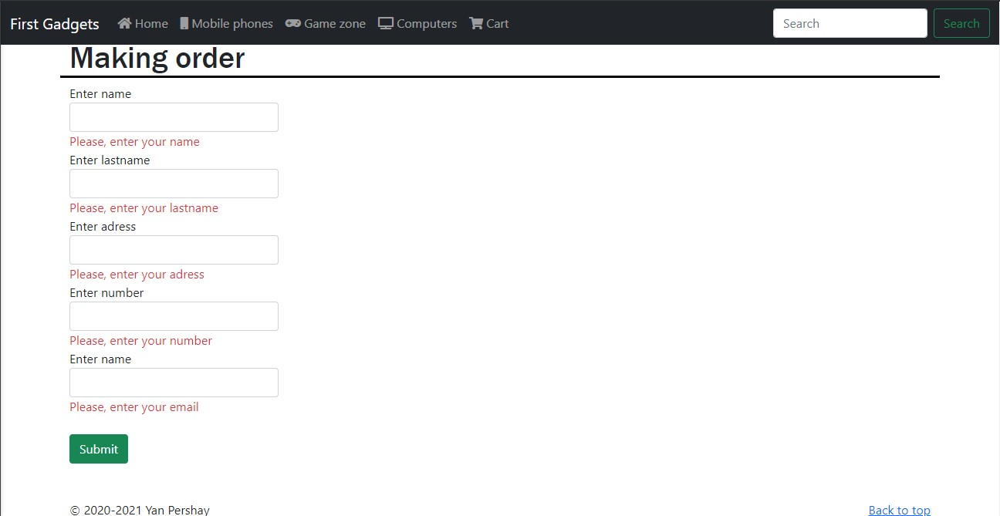

# Simple Online Store
This is a simple online store. Written in ASP.NET Core MVC. Allows you to select a product, add it to the cart and order. Data is stored in the MSSQL database. Using CodeFirst.

There is the Home page, which show us all Products in store.

 

All products divides to some categories and нou can choose which of the categories to display.

 

It is possible to add items to the cart.

 

After going to the checkout page, it is possible to fill in the customer data and there is also data validation.

 